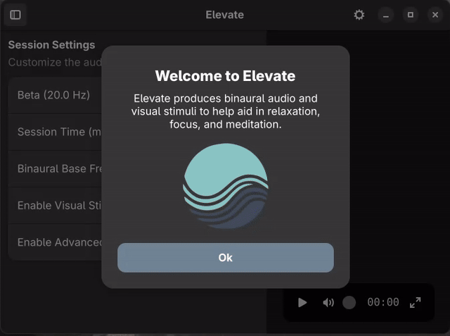

# Elevate

Elevate is a desktop meditation application for helping to achieve mental states (e.g., Relaxation, Focus, etc) through audio (binaural beats) and visual stimuli.

<p align="center">
  
</p>

NOTE: The project is still in it's infancy, but feedback is welcomed!

# Keybindings

The application currently supports a few keybindings as seen below.

| Key       | Action                     |
|-----------|----------------------------|
| `s`       | Show Sidebar              |
| `f`       | Enable full screen        |
| `esc`     | Escape full screen (when full screen) |
| `space`   | Play the binaural         |

## Manually Building

This project template was setup with GNOME Builder, should you should be able to directly import and build the project from GNOME Builder.

Using flatpak:

```
flatpak-builder --force-clean --user --install builddir io.github.thecodenomad.elevate.json
```

Alternatively, you can use foundry to build and export to a flatpak:

```
foundry build
foundry export
```

## License

This project is licensed under the GPLv3.0 License - see the COPYING file for details.
